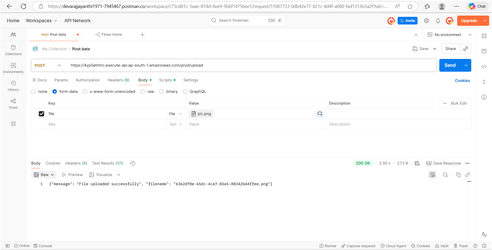
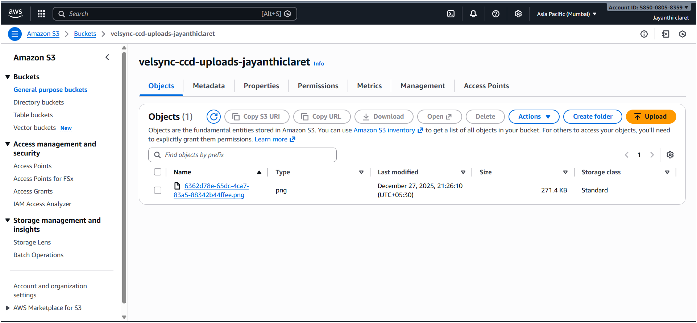

# Task 04 – Serverless File Upload API

## Internship Track
Cloud Computing & DevOps (CCD)

## Description
This task demonstrates building a serverless file upload API using AWS services.
The API accepts an image file via HTTP POST request and stores it in an Amazon S3 bucket.

## Services Used
- AWS Lambda
- AWS API Gateway (HTTP API)
- Amazon S3
- Python
- Postman

## API Details
- Method: POST  
- Route: /upload  
- Stage: prod  
- Request Type: multipart/form-data  
- Form Key: file  

## Workflow Details
- Client sends a file using Postman
- API Gateway receives the request
- Lambda function processes the file
- File is uploaded to Amazon S3
- Success response is returned

## Proof of Execution
Below are the outputs showing successful execution of Task 04:

  
  

## Result
The serverless API was successfully deployed and tested.
Files are uploaded securely to Amazon S3 using AWS Lambda and API Gateway.
